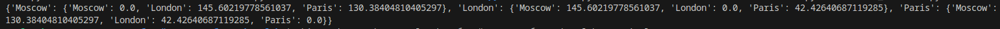
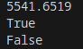
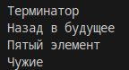
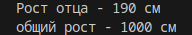
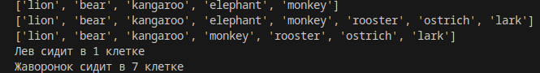
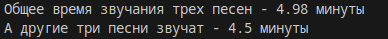
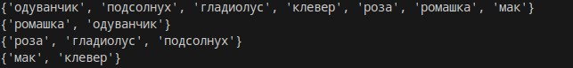
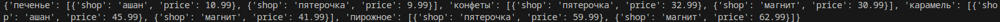
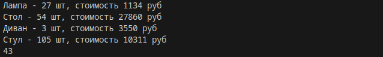

# Отчет по первой лабораторной работе
# Задание

Сложность:
    Rare

    Создайте репозиторий для дисциплины на GitHub или GitLab
    Склонируйте его себе на ПК
    Скачайте архив и распакуйте его в свой репозиторий. В нём 11 заданий, которые вам нужно выполнить
    Напишите отчёт в README.md. Отчёт должен содержать:
        Задание
        1. Описание проделанной работы
        2. Шпаргалку по работе с командами git
        3. Скриншоты результатов
        4. Ссылки на используемые материалы
        5. Сделайте commit и push
1. Задание 1
    Описание: создал 2 цикла для вычисления дистанции.
     Результат:
    
2. Задание2 
    Описание: расчитал по формуле площадь круга и вывел результаты сравнения в консоль.
    Результат:
    
3. Задание 3
    Описание: написал формулу для 1 2 3 4 5 и вывел значение в консоль.
    Результат:
    
4. Задание 4
    Описание: с помощью срезов вывел в консоль названия фильмов.
    
5. Задание 5
    Описание: создал список роста семьи и вывел необходимые данные используя список.
    Результат:
    
6. Задание 6
    Описание: используя команды "insert, extend, index, remove" вывел необходимые данные в консоль.
    Результат:
    
7. Задание 7
    Описание: расчитал общее время проигрывания песен и вывел его.
    Результат:
    
8. Задание 8
    Описание: с помощью срезов вывел необходимые слова на экран.
    Результат:
    
9. Задание 9
    Описание: создал множества командой set() и с помощью опред. символов вывел их в необходимом порядке.
    Результат:
    
10. Задание 10
    Описание: создал словарь и вывел его.
    Результат:
    
11. Задание 11
    Описание: из двух словарей вывел необходимые данные и расчитал кол-во предметов и их общую цену. 
    Результат:
    
# Шпаргалка по работе с командами git
    1. git clone "ссылка" - команда для создания копии удаленного репозитория без рабочего каталога.
    2. git status - отображает состояние рабочего каталога и раздела проиндексированных файлов.
    3. git add sth - Переносит изменения из рабочего каталога в раздел проиндексированных файлов.
    4. git commit -m "комментарий" - создаёт новый коммит, в основе которого лежат уже существующие файлы, добавляя изменения только для указанных файлов.
    5. git push - позволяет отправлять локальную ветку на удаленный репозиторий.
# Ссылки на исп. материалы
[Офицальный гайд по python](https://docs.python.org/3/tutorial/)