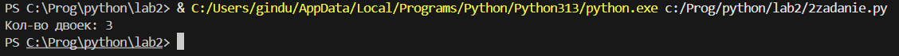

# Отчет
## Задание №1
Ольга составляет таблицу кодовых слов для передачи сообщений, каждому сообщению соответствует своё кодовое слово. В качестве кодовых слов Ольга использует 4-буквенные слова, в которых есть только буквы A, B, C, D, X, Y, Z. При этом первая буква кодового слова  — это буква X, Y или Z, а далее в кодовом слове буквы X, Y и Z не встречаются. Сколько различных кодовых слов может использовать Ольга?
### Описание проделанной работы
Импортиртировал библиотеку `itertools` для работы с множествами и сочетаниями. Выполнил перебор всех возможных вариантов использования 4-буквенных слов, удовлетворяющих условию, и подсчитал количество различных кодовых слов.
### Результаты

## Задание №2
Значение арифметического выражения $9^8 + 3^5 − 9$ записали в системе счисления с основанием 3. Сколько цифр 2 содержится в этой записи?
### Описание проделанной работы
Нашел значние выражения. В цикле While перевёл число в трехичную систему счисления, проверил наличие цифры 2 и подсчитал их кол-во.
### Результаты

## Задание №3
Найдите все натуральные числа, принадлежащие отрезку 
[40000; 50000], у которых ровно пять различных нечётных делителей (количество чётных делителей может быть любым). Выведите найденные числа в порядке возрастания.
### Описание проделанной работы
Сделал цикл по числам. В цикле проверил каждое число на соответствие условию. Если число удовлетворяло условию, то выводил его в консоль.
### Результаты

## Список используемых источников:
1. [Itertools в Python - Хабр](https://habr.com/ru/companies/otus/articles/529356/)
2. [Writing mathematical expressions](https://docs.github.com/en/get-started/writing-on-github/working-with-advanced-formatting/writing-mathematical-expressions)
3. [Официальный Python tutorial](https://docs.python.org/3/tutorial/)
4. [Мир Python: doctest | Python для продвинутых - Хекслет](https://ru.hexlet.io/courses/advanced_python/lessons/python-doctest/theory_unit#:~:text=Doctest%20%D0%B4%D0%BB%D1%8F%20%D1%84%D1%83%D0%BD%D0%BA%D1%86%D0%B8%D0%B9,-%D0%94%D0%BB%D1%8F%20%D0%BF%D1%80%D0%B8%D0%BC%D0%B5%D1%80%D0%B0%20%D1%80%D0%B0%D1%81%D1%81%D0%BC%D0%BE%D1%82%D1%80%D0%B8%D0%BC&text=%D0%A4%D1%83%D0%BD%D0%BA%D1%86%D0%B8%D1%8F%20%D0%B2%D1%8B%D1%87%D0%B8%D1%81%D0%BB%D1%8F%D0%B5%D1%82%20%D1%84%D0%B0%D0%BA%D1%82%D0%BE%D1%80%D0%B8%D0%B0%D0%BB%20%D0%B2%20%D1%86%D0%B8%D0%BA%D0%BB%D0%B5,%D0%BF%D1%80%D1%8F%D0%BC%D0%BE%20%D0%B2%20%D0%B4%D0%BE%D0%BA%D1%83%D0%BC%D0%B5%D0%BD%D1%82%D0%B0%D1%86%D0%B8%D0%B8%20%D0%BF%D0%B8%D1%88%D0%B5%D1%88%D1%8C%20%D1%82%D0%B5%D1%81%D1%82%D1%8B.)