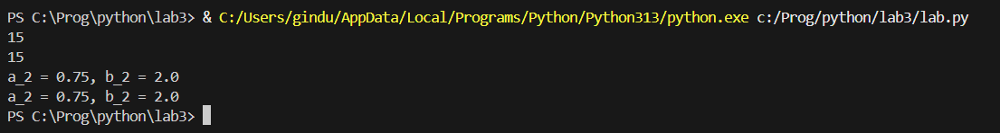

# Отчет
## Задание
Написать две функции для решения задач 2 варианта - с использованием рекусрсии и без.
### Описание проделанной работы
С помощью рекурсии и итерации написал функции для задач.
### Результаты

## Список используемых источников:
1. [Официальный Python tutorial](https://docs.python.org/3/tutorial/)
2. [🐍 Самоучитель по Python для начинающих. Часть 13: Рекурсивные функции - proglib.io](https://proglib.io/p/samouchitel-po-python-dlya-nachinayushchih-chast-13-rekursivnye-funkcii-2023-01-23)
3. [Python Testing с pytest. Начало работы с pytest](https://habr.com/ru/articles/448782/)
