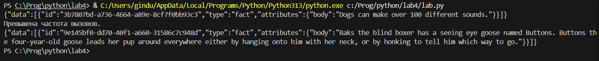

# Отчет
## Задание №1
Замыкание для получение текста ответа на запрос к API, например https://dogapi.dog/api/v2/facts.
### Описание проделанной работы
Импортировал библиотеку requests и сделал замыкание, для получения текстового ответа на запрос к предложенному api.
### Результаты

## Задание №2
Декоратор, ограничивающий частоту вызовов функций.
### Описание проделанной работы
Импортировал библиотеку time для проверки времени и сделал декоратор, который ограничивает число вызовов функции.
### Результаты

## Список используемых источников:
1. [Замыкания и декораторы в Python: часть 1 — замыкания](https://habr.com/ru/articles/781866/)
2. [Замыкания и декораторы в Python: часть 2 — декораторы](https://habr.com/ru/articles/800239/)
3. [Библиотека Requests для Python: код и практика](https://skillbox.ru/media/code/biblioteka-requests-dlya-python-kod-i-praktika/)
4. [Официальный Python tutorial](https://docs.python.org/3/tutorial/)