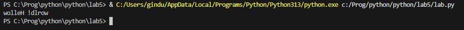

# Отчет
## Задание
Генератор для построчного чтения файла. Если длина строки превышает заданный предел - возвращает подстроку допустимого размера. Переверните слова в строках, возращаемых генератором.
К генератору должна быть применена хотя бы одна из функций map, reduce, filter.
### Описание проделанной работы
С помощью оператора with и функции open() реализовал открытие файла для последующей проверки на максимальную длинну и переворота слов с помощью функции map(). Создал файл, в котором находится текст для проверки работоспособности.
### Результаты

## Список используемых источников:
1. [Использование функции map в Python](https://www.digitalocean.com/community/tutorials/how-to-use-the-python-map-function-ru)
2. [Генераторы в Python](https://habr.com/ru/articles/866616/)
