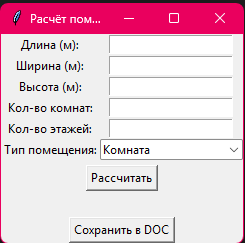

# Отчет
## Задание
1. По своему варианту задания создайте пакет, содержащий 3 модуля, и подключите его к основной программе.
2. Основная программа должна предоставлять:
графический пользовательский интерфейс с возможностями ввода требуемых параметров и отображения результатов расчёта,
возможность сохранить результаты в отчёт формата .doc или .xls (например, пакеты python-docx и openpyxl).
### Описание проделанной работы
Сделал функции для расчета общей площади помещения и тепловой мощности для обогрева помещения. С помощью python-dox реализовал возможность сохранения отчета в dox файл, а так же с использованием GUI-фреймворка Tkinter сделал графической инетрфейс для использования программы.
### Результаты

## Список используемых источников:
1. [Создание/изменение документов MS Word на Python](https://docs-python.ru/packages/modul-python-docx-python/)
2. [Руководство по Tkinter](https://metanit.com/python/tkinter/)
3. [Офицальный гайд по python](https://docs.python.org/3/tutorial/)